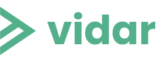

# Vidar

Copyright (c) 2022-2023 [Antmicro](https://www.antmicro.com)



Vidar is a lightweight, open-source video sharing platform that allows you to quickly and easily host your video content with a minimal, straightforward setup that requires only one computer.
Designed especially for post-event video content dissemination, it is easily extendible and allows you to add other assets to accompany your videos (such as slideshows or presentation files).

## Features

- Show upcoming event on the main page
- Link to a page with presentations and attach them to events
- Add timestamps to your videos
- View events history
- Search events by name or speaker
- Categorize your materials using tags
- Filter events by tags, date, or speaker

## Technology

Vidar is built from reusable Svelte components.

Svelte is a web framework that allows developers to build highly performant web applications using a concise syntax.
Svelte's lightweight nature and focus on compile-time optimizations make it a great choice for easily maintainable and modifiable projects like Vidar.

Vidar stores all your event-related data in JSON files to provide a simple project structure and eliminate the need to develop complex backend solutions.

## Requirements

To install Vidar, you need the following packages:

| Package name | Version   |
| ------------ | --------- |
| Node         | >=18.9.0  |
| yarn         | >=1.22.19 |

You can install [node](https://nodejs.org/en/) using your distribution's package manager, for example in Debian:

```sh
apt install nodejs
```

To install [yarn](https://yarnpkg.com/), run the following command in your terminal:

```sh
npm install --global yarn
```

## Adding your own content

Information about events in Vidar is stored in `data.json` files, each in a separate subfolder (one per event) in the `event_data` directory.
You should add a video, a slide deck (optional) and thumbnail for each event to the corresponding event's folder.
In the `event_data/video_1` directory, you can find a `data.json` file filled with sample information.

### Adding upcoming events

The `upcoming` field in the `data.json` file refers to a video displayed on the main page as an upcoming event.
Upcoming events must have the `upcoming` field set to `true`.

If you want to add a link to a live stream of the upcoming event, you need to add the `livestream` property:

```json
"livestream": "link to the livestream"
```

### Defining the date and time of the event

The `datetime` field describes the time and date of the event using Unix time (e.g., January 1, 2022, 8 am in Unix time is 1641024000).
To convert your dates to Unix time, use the `date` command in your terminal (mm/dd/yyyy):

```
date -d '01/01/2022 08:00:00' +'%s'
```

### Adding timestamps

The field timestamps describe sections of your video, which will be visible in the video player.
The start and end of the timestamp need to be expressed as seconds from the beginning of the video.
Note that separate sections cannot overlap, e.g. if one ends at 3 seconds, the next one needs to start at 4. 

Should you not want to use timestamps, you need to leave a single timestamp in the `data.json` file and change the `from` to 0 and the `to` value to the final second of your video (e.g 122 for a 2:02 video). 
Also, make sure the `title` field is empty - `"title": ""`.
Otherwise, the playback progress bar will not be visible.

For [upcoming videos](#adding-upcoming-events), make sure the `from` and `to` values are set to 0 and the `title` field is empty.

### Modifying Vidar appearance

To add your custom assets, you need to create an `external_assets` folder in the root of the project.

The `external_assets` folder must contain an `images` subfolder where the new assets will be located.

A new asset must have the same name as the asset in `./src/lib/images` that you want to replace.
To see your newly replaced assets, you must rebuild the project.

You can also override the default `styles.css` located in `./src/routes` by copying the default file and placing an edited version in the `external_assets` directory.

### Creating speaker profiles

After defining all of your events in the appropriate `data.json` files, you need to add all speakers from the `authors` sections in all your `data.json` files to the `authors.json` file located in the `event_data` folder.
Note that the `authors.json` file cannot contain duplicates in the `id` fields.

Adding a speaker to `authors.json` will enable you to click their name and visit their speaker profile in Vidar. The speaker profile is defined in the `profile` field within the `contact` object.

If the speaker does not have an entry in `authors.json`, clicking their name will generate a `page not found` error.

You also need to place your `authors.json` file in the `src/lib/jsons` directory, because this is where the data is parsed from.

### Generating tags

After populating events' `data.json` files with your event data, you need to run the `GenerateTags.py` Python script located in the root folder to generate tags defined in the `tags` array.

To run the `GenerateTags.py` script, use the following in the Vidar root directory:

```sh
python3 GenerateTags.py
```

You should run this script whenever you use a new tag in one of your `event_data` JSON files or with every new deployment to ensure everything works correctly.
Otherwise, the newly added tags will not be visible on the main page.

## Deployment

With all the above steps completed, you can run a local instance of Vidar and generate Vidar's static files.
To install the project's dependencies, run the following command in Vidar's root directory:

```sh
yarn install
```

You can now run Vidar locally using:

```sh
yarn dev
```

To generate static files, run:

```sh
yarn build
```

Then, place your generated static files on your server, with respect to your particular infrastructure.

## License

[Apache-2.0](LICENSE)
